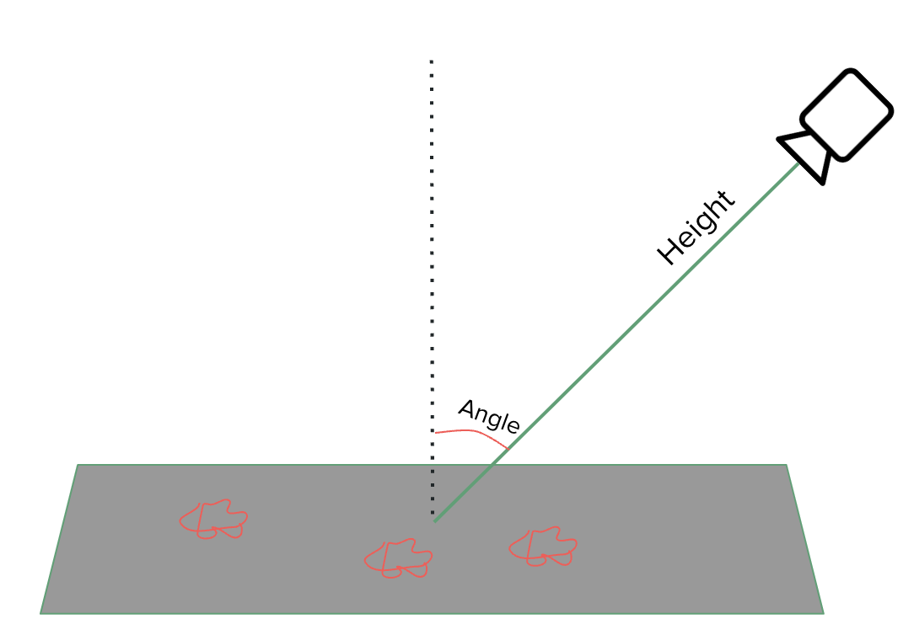

# Blender Synthetcis

Create your own synthetic dataset for object detection.

## Description

This repo creates random scenes on blender, imports custom 3D models with randomised configurations, and renders numerous images with annotations to train an object detection model.

## Getting Started

### Install blender (Tested on 3.2 and 3.3)

- Follow installation instructions [here](https://www.blender.org/download/) 
- Add blender to PATH
    - `echo 'export PATH=/path/to/blender/directory:$PATH' >> ~/.bashrc`
- Ensure your GPU is supported on blender. Refer [here](https://docs.blender.org/manual/en/latest/render/cycles/gpu_rendering.html)

### Clone repo

```
git clone https://github.com/wish2023/blender-synthetics.git
```

### Install packages

```
sh install_requirements.sh your/blender/dir/location/**version_number**
```
## Generate synthetics

- Update `data/models.yaml` and `data/config.yaml` as required. Refer to [models](#models) and  [configurations](#configurations) for details.
- Generate images
    - `blender --background --python src/render_blender.py`
- Generate annotations
    - `python3 src/create_labels.py`

## Models

### Classes

Your targets of interest. Bounding boxes will be drawn around these objects.

### Obstacles (Optional)

Other objects which will be present in the scene. These won't be annotated.

### Scenes (Optional)

Textures that your scene may have. Explore possible textures from [texture haven](https://polyhaven.com/textures) and store all texture subfolders in a main folder.

## Configurations

### Occlusion awareness

When not occlusion aware, bounding boxes will surround regions of the object that aren't visible by the camera.


#### Visibility threshold

The fraction of an object that must be visible by the camera for it to be considered visible to a human annotator.


#### Component visibility threshold

The fraction of an object components that must be visible by the camera for it to be considered visible to a human annotator.


### Camera configurations



### Sun

The sun's energy is the light intensity on the scene. The tilt is responsible for casting shadows and works similar to the camera's tilt.
