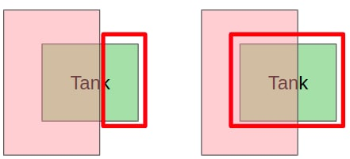

# Blender Synthetics

Create synthetic datasets for object detection using Blender.

## Description

Blender Synthetics is a repository designed to help you create synthetic datasets for object detection tasks. It automates the process of generating random scenes in Blender, importing custom 3D models with randomized configurations, and rendering numerous images with annotations. These datasets can be used to train and evaluate object detection models.

## Table of Contents

1. [Getting Started](#getting-started)
   - [Clone the Repository](#clone-the-repository)
   - [Linux Installation](#linux-installation)
   - [Windows Installation (with Anaconda)](#windows-installation-with-anaconda)
1. [Generate Synthetics](#generate-synthetics)
1. [Models](#models)
1. [Parameters](#parameters)

## Getting Started

This repo was tested on the following:

- Python 3.10
- Blender 3.2 or 3.3 (Linux), Blender 3.6.4 (Windows)

### Clone the Repository

```bash
git clone https://github.com/tehwenyi/blender-synthetics.git
```

### Linux Installation

1. **Install Blender:**
   - Follow the installation instructions [here](https://www.blender.org/download/).
   - Add Blender to your PATH by running the following command:

        ```bash
        echo 'export PATH=/path/to/blender/directory:$PATH' >> ~/.bashrc
        ```
    
1. **Verify GPU Compatibility:**

    Ensure your GPU is supported by Blender. Refer to the [official documentation](https://docs.blender.org/manual/en/latest/render/cycles/gpu_rendering.html) for compatibility details.

1. **Install Required Packages:**

    ```bash
    sh install_requirements.sh
    ```

### Windows Installation (with Anaconda)

1. **Install Blender:**
    
    Download Blender from the official website: [Blender Downloads](https://www.blender.org/download/).

2. **(Anaconda) Create a Virtual Environment with Anaconda:**

    - Follow Anaconda installation instructions: [Anaconda Installation](https://docs.anaconda.com/free/anaconda/install/windows/).
    - Launch Anaconda Prompt and create a virtual environment for Blender:

        ```bash
        conda create --name blender python=3.10
        ```

3. **(Anaconda) Add Blender to the PATH:**

    - Create a batch script (a .bat file) that will launch Blender. You can do this using a text editor. Create a new file with a `.bat extension` (e.g., blender_launcher.bat) and add the following line (replace the path with the actual Blender executable path.):

        ```bat
        "C:\Program Files\Blender Foundation\Blender 3.6\blender.exe"
        ```

    - Copy the batch script to your Anaconda environment's `Scripts` directory. (eg. `"C:\Anaconda3\envs\your_env_name\Scripts"`)
    - If you are not using Anaconda, you will have to do the equivalent of this for your virtual environment/PowerShell.

4. **(Anaconda) Activate Your Anaconda Environment:**

    ```bash
    conda activate blender
    ```

5. **Install bpycv in Blender:**

    You may run this in PowerShell or your virtual environment.

    ```bash
    blender -b --python-expr "from subprocess import sys, call; call([sys.executable,'-m','ensurepip'])"
    blender -b --python-expr "from subprocess import sys, call; call([sys.executable]+'-m pip install --target="$TARGET" -U pip setuptools wheel'.split())"
    blender -b --python-expr "from subprocess import sys, call; call([sys.executable]+'-m pip install --target="$TARGET" -U bpycv'.split())"
    ```

6. **Install Required Python Packages in Blender:**

    - Locate Blender's Python executable in the Blender installation directory. (eg. `"C:\Program Files\Blender Foundation\Blender 3.6\3.6\python\bin\python.exe"`)
    - Ensure you are in the folder of this repo (containing `requirements.txt`).
    - Option 1: Run the following in PowerShell (with administrative rights):
        ```
        & "C:\Program Files\Blender Foundation\Blender 3.6\3.6\python\bin\python.exe" -m pip install -r requirements.txt
        ```
    - (Anaconda) Option 2: Run the following command in your Anaconda Prompt:
        ```bash
        "C:\Program Files\Blender Foundation\Blender 3.6\3.6\python\bin\python.exe" -m pip install -r requirements.txt
        ```
    - Option 3: Install the packages via your virtual environment.

7. **Setup Completed**

    You have completed the setup. Proceed to [Generate synthetics](#generate-synthetics) to run the synthetic dataset generation process. 

    Generating Images can be done from PowerShell or your virtual environment, but Generating Annotations must be done in your virtual environment.

## Generate Synthetics

To generate synthetic datasets for object detection:

1. **Update `config/models.yaml` and `config/render_parameters.yaml` as needed.** Refer to [Models](#models) and [Parameters](#parameters) for more details.

2. **Generate Images:**

    `blender -b -P src/render_blender.py`

3. **Generate Annotations:**

    `python3 src/create_labels.py`

## Models
Currently supports fbx/obj/blend. Ensure your models only contain one object that has the same name as its filename.

### Classes

Your targets of interest. Bounding boxes will be drawn around these objects.

### Obstacles (Optional)

Other objects which will be present in the scene. These won't be annotated.

### Scenes (Optional)

Textures that your scene may have. Explore possible textures from [texture haven](https://polyhaven.com/textures) and store all texture subfolders in a main folder.

## Parameters

### Occlusion awareness

When not occlusion aware, bounding boxes will surround regions of the object that aren't visible by the camera.



#### Visibility threshold

The fraction of an object that must be visible by the camera for it to be considered visible to a human annotator.


#### Component visibility threshold

The fraction of an object components that must be visible by the camera for it to be considered visible to a human annotator.


### Camera configurations


### Sun

The sun's [energy](https://docs.blender.org/manual/en/latest/render/lights/light_object.html) is the light intensity on the scene. The tilt is responsible for casting shadows and works similar to the camera's tilt.
